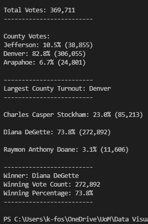

# Overview of Election Audit
The purpose of the election audit and analysis is to count all submitted votes and determine the winning official.  In addition to presenting the winner, the following data was collected and presented to the commission:

- The voter turnout for each county
- The percentage of votes from each county out of the total count
- The county wiht the highest turnout

# Election-Audit Results



- ### How many votes were cast in this congressional election?

    369,711 total votes were cast in the congressional election

    ###### each row in the file represented a vote
    
    ```python
    total_votes = 0

    with open(file_to_load) as election_data:
        reader = csv.reader(election_data)

        for row in reader:

            total_votes = total_votes + 1
    ```

- ### Provide a breakdown of the number of votes and the percentage of total votes for each county in the precinct.

    - Jefferson county made up 10.5% of total votes with 85,213
    - Denver county made up 82.8% of total votes with 306,055
    - Arapahoe county made up 6.7% of total votes with 24,801  
  
  
    ###### store county:count in a dictionary

    ```python
    for row in reader:
        
        if county_name not in counties:

            # 4b: Add the existing county to the list of counties.
            counties.append(county_name)

            # 4c: Begin tracking the county's vote count.
            counties_votes[county_name] = 0

        # 5: Add a vote to that county's vote count.
        counties_votes[county_name] += 1    
    ```

- ### Which county had the largest number of votes?

- ### Provide a breakdown of the number of votes and the percetnage of the total votes each candidate received.

- ### Which candidate won the election, what was their vote count, and what was their percentage of the total votes?


# Election-Audit Summary

## Business Proposal

### Modification #1

### Modification #2